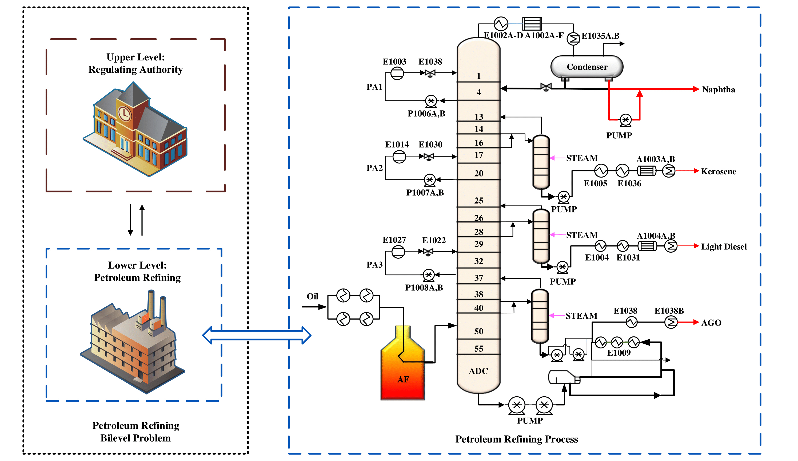

# TKDEA

> This repository contains materials related to our paper published in TCYB 2024

## Introduction

Bilevel optimization is a special type of optimization in which one problem is embedded within another. The bilevel optimization problem of which both levels are multiobjective functions is usually called the multiobjective bilevel optimization problem (MBLOP). The expensive computation and nested features make it challenging to solve. However, not every lower-level solution will participate in the bilevel Pareto-optimal front.

We propose a multiobjective bilevel optimization solving routine combined with a knee point driven algorithm. Specifically, the proposed algorithm aims to quickly find feasible solutions considering the lower-level constraints in the first stage and then concentrates the computational resources on finding solutions with better performance. 

Besides, we develop several multiobjective bilevel test problems with different properties, such as scalable, deceptive, convexity, and (dis)continuous.  

Finally, the performance of the algorithm is validated on a practical petroleum refining bilevel problem, which involves a multiobjective environmental regulation problem and a petroleum refining operational problem.

*Petroleum Refining Operational Problem*

## Code

The relevant code is in the process of being organized.

## Contact

If you meet any problems, please feel free to contact me.

- Jiaxin Chen (chenjiaxin1934@gmail.com)
